# SLJ Prediction Showcase

A visual and technical showcase of the Standing Long Jump (SLJ) prediction platform: from raw sensor/video data to phase-aware features and model-driven distance estimation.

This repository is intentionally a showcase-only publication.
The full development repository (source code, experiments, and internal tooling) is private for the time being.

## Table of Contents

- [1. What This Showcase Covers](#1-what-this-showcase-covers)
- [2. System Story in One Video](#2-system-story-in-one-video)
- [3. End-to-End Workflow](#3-end-to-end-workflow)
- [4. Pipeline GUI Walkthrough](#4-pipeline-gui-walkthrough)
- [5. Feature Extraction GUI](#5-feature-extraction-gui)
- [6. Model Training and Analysis](#6-model-training-and-analysis)
- [7. Key Engineering Points](#7-key-engineering-points)
- [8. Showcase Repository Structure](#8-showcase-repository-structure)
- [9. Private Repository Note](#9-private-repository-note)

## 1. What This Showcase Covers

The SLJ system is designed as a complete biomechanics pipeline with four connected layers:

1. Data operations layer (session/athlete/jump organization and processing states).
2. Annotation and ground-truth layer (video-based takeoff/landing labels and event timelines).
3. Feature engineering layer (domain-aware and statistical feature extraction).
4. Modeling layer (U-Net timing intelligence plus regression for jump length estimation).

This showcase focuses on the user-facing interfaces, process observability, and training evidence.

## 2. System Story in One Video

The primary visual artifact in this showcase is the SLJ process video below.

<video controls src="https://github.com/Nektarios-I/SLJ_Prediction_Showcase/raw/main/SLJ_Video_Unfinished_Cut_Showcase%20-%20Trim.mp4"></video>

Fallback direct file: [SLJ_Video_Unfinished_Cut_Showcase - Trim.mp4](https://github.com/Nektarios-I/SLJ_Prediction_Showcase/raw/main/SLJ_Video_Unfinished_Cut_Showcase%20-%20Trim.mp4)

What it represents:

- Real-time style signal progression and stage transitions.
- How key movement phases are isolated from continuous data streams.
- The core idea of moving from raw signals to interpretable metrics.

## 3. End-to-End Workflow

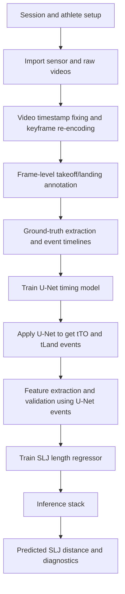

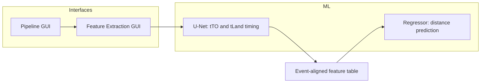

This sequence is intentional: U-Net is trained first, then used to produce takeoff/landing timing events, and those events are required to build the final feature table for SLJ length model training.

## 4. Pipeline GUI Walkthrough

### 4.1 Main dashboard and process entry points

The dashboard is designed as an operational control panel with explicit navigation, a quick-start area, and an activity log.

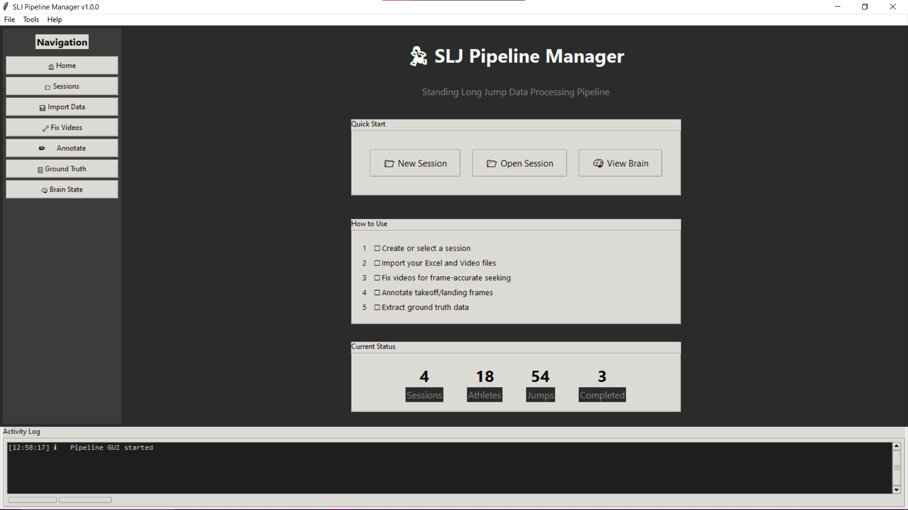

### 4.2 Session management and reproducible organization

Session selection exposes date/location metadata, athlete counts, and current processing completion state.

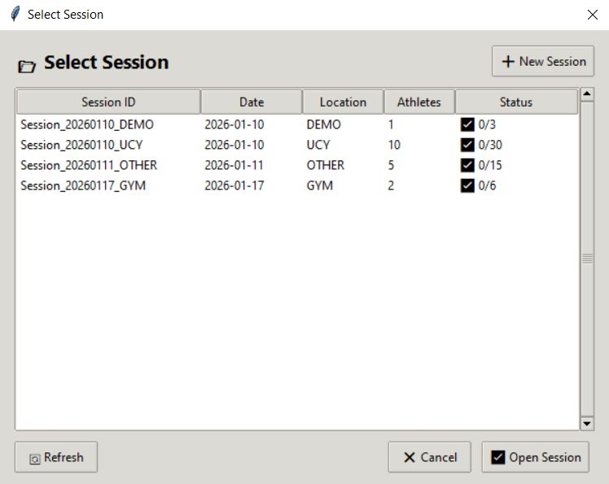

The session home view then maps each core data directory and athlete jump status in one place.

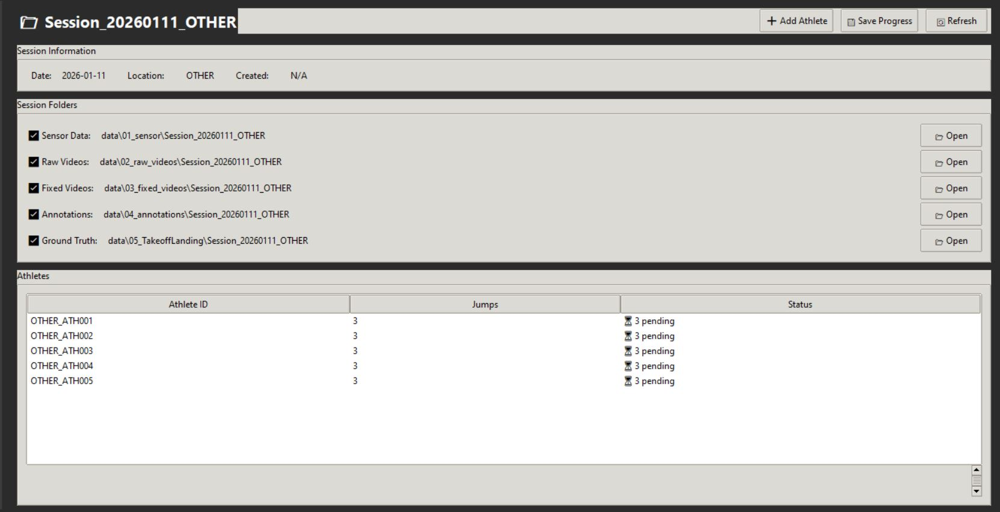

### 4.3 Data import flow

The import screen gives naming guidance, folder-level ingestion, and detection status to reduce data quality drift early.

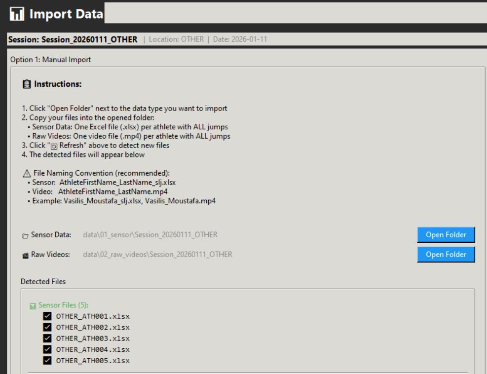

Quick actions support folder opening, athlete registration from files, naming standardization, and refresh.

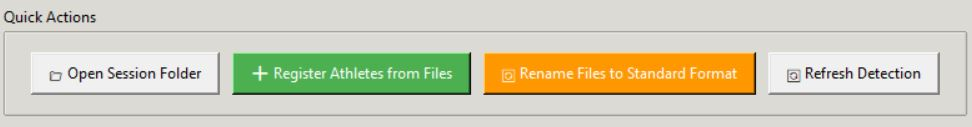

### 4.4 Video timestamp fixing for reliable annotation

This stage shows a queue of videos with pending/fixed status and enables batch keyframe re-encoding for frame-accurate navigation.

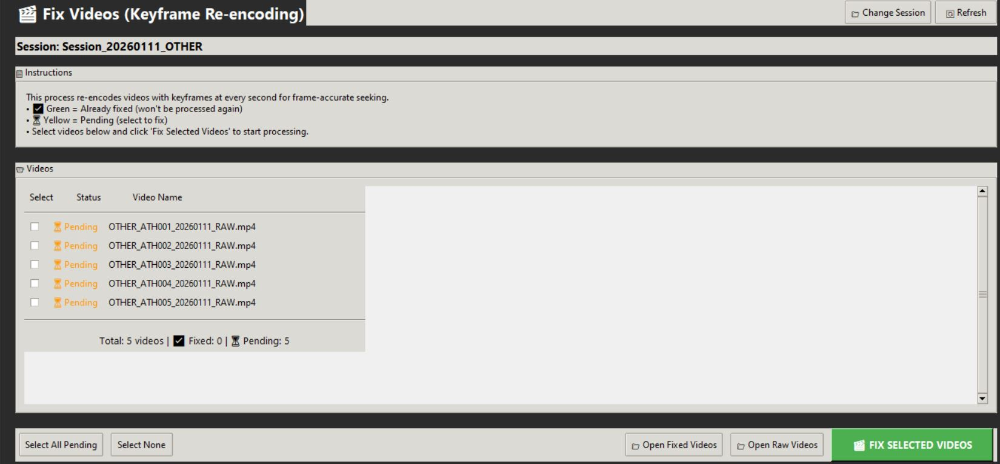

### 4.5 Annotation workflow

The annotation screen integrates instructions, keyboard controls, queue status, and the external frame viewer used to mark takeoff/landing.

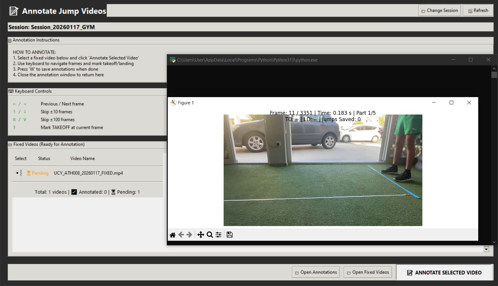

### 4.6 Ground-truth generation and visualization

Ground-truth tooling allows per-athlete execution, PCA-rotated analysis mode, and direct visualization of acceleration, velocity, and jerk-derived event context.

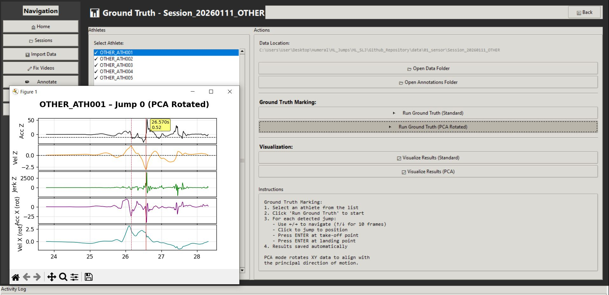

## 5. Feature Extraction GUI

The feature GUI is the bridge between curated jump events and model-ready tabular datasets.

### 5.1 Dashboard and parameterization

This view includes session and athlete selection, sensor/upsampling/filter settings, quiet-window controls, validation toggles, progress logging, and export controls.

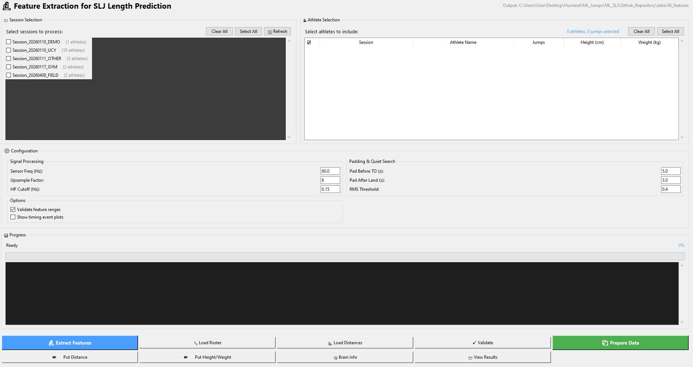

### 5.2 Guided usage video

A full walkthrough of the feature pipeline is provided below.

<video controls src="https://github.com/Nektarios-I/SLJ_Prediction_Showcase/raw/main/feature_gui/SLJ%20Feature%20Extraction_Features_GUI.mp4"></video>

Fallback direct file: [SLJ Feature Extraction_Features_GUI.mp4](https://github.com/Nektarios-I/SLJ_Prediction_Showcase/raw/main/feature_gui/SLJ%20Feature%20Extraction_Features_GUI.mp4)

## 6. Model Training and Analysis

### 6.1 U-Net training and evaluation (timing intelligence)

This training stream emphasizes phase/timing quality and segmentation fidelity.

WandB charts (hyperparameter and convergence behavior):

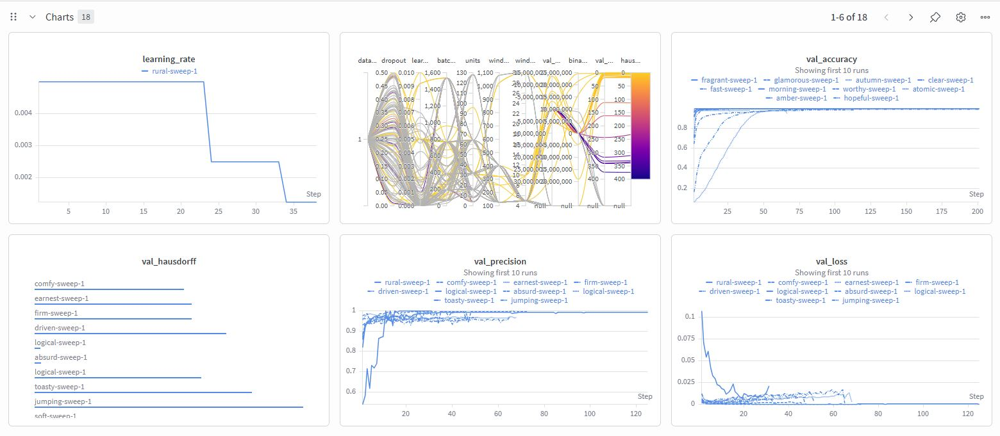

Kaggle evaluation notebook snapshot (predicted probability and event-aligned curves):

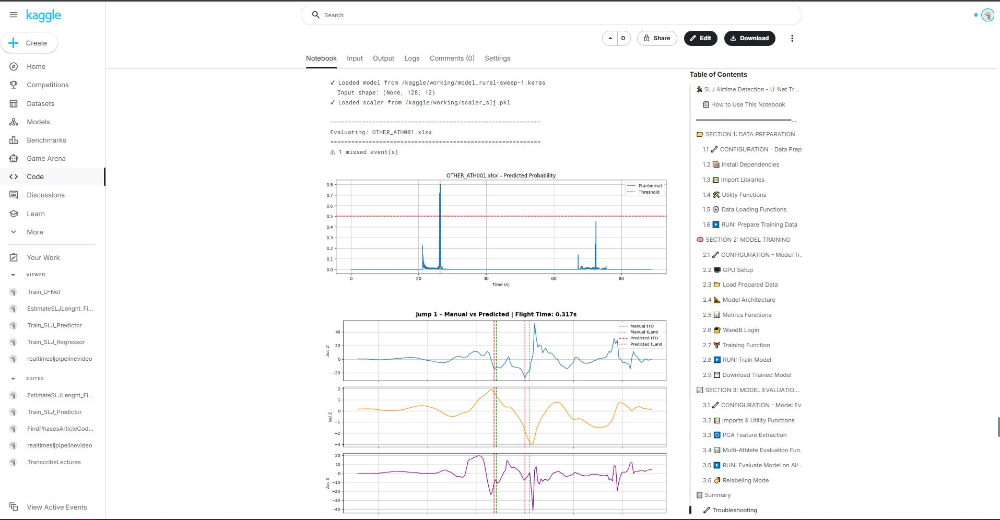

### 6.2 SLJ regressor training (distance prediction)

The regressor pipeline includes staged feature filtering/selection and model-family benchmarking.
Its training data is built after U-Net timing inference, using U-Net-derived tTO/tLanding boundaries for event-aligned feature generation.

Feature Stage 1 diagnostics:

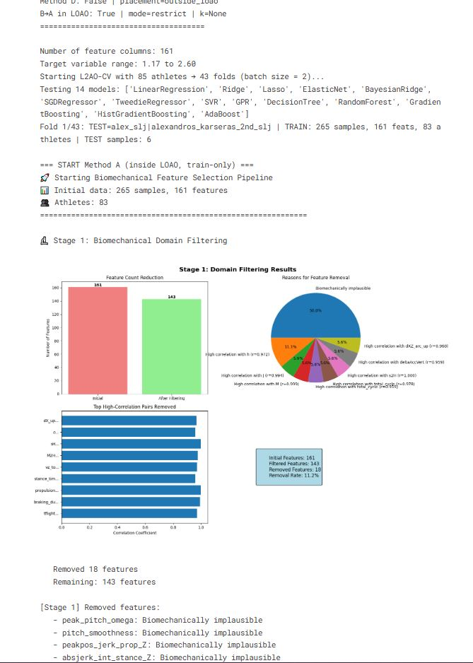

Feature stages 2/3/4 summary:

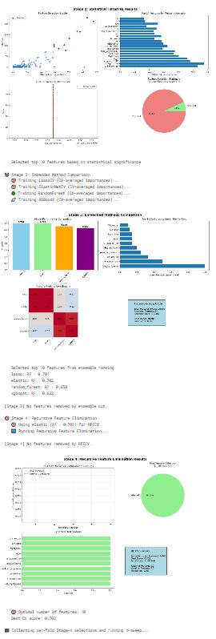

WandB query panels for experiment analysis:

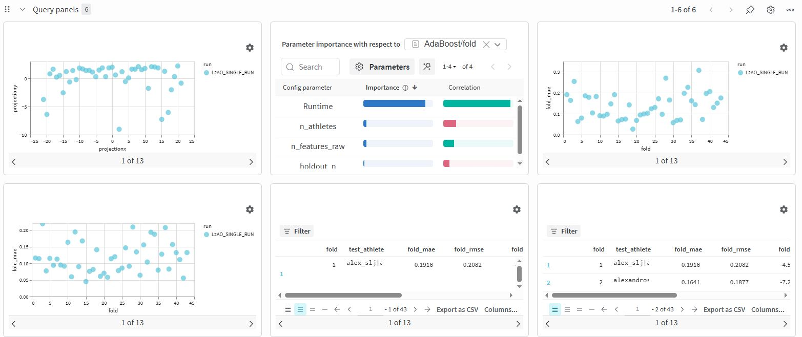

SGD regressor experiment panel view:

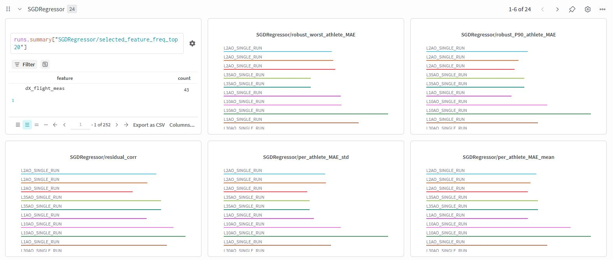

## 7. Key Engineering Points

- Stage-gated pipeline architecture: explicit operational phases reduce ambiguity in multi-athlete, multi-session processing.
- Human-in-the-loop labeling: annotation tooling preserves frame-level traceability for takeoff/landing decisions.
- Deterministic preprocessing path: fixed ingest and transformation stages improve experiment repeatability.
- Hybrid modeling strategy:
  - U-Net is trained first to provide temporal structure and event localization.
  - U-Net event predictions are used to build event-aligned features.
  - Regressor maps those engineered features to final distance prediction.
- Experiment observability: Kaggle and WandB artifacts provide training transparency and comparative analysis at scale.

## 8. Showcase Repository Structure

```text
Github_Showcase/
  README.md
  SLJ_Video_Unfinished_Cut_Showcase - Trim.mp4
  SLJ_Video_Unfinished_Preview.jpg
  pipeline_gui/
    Dashboard_P.png
    NewSession_P.JPG
    SesseionHome_P.JPG
    ImportDataA_P.JPG
    ImportDataB_P.JPG
    FixVideoMenu_P.JPG
    AnnotateVideo_P.JPG
    GroundTruth_P.JPG
  feature_gui/
    Dashboard_F.JPG
    SLJ Feature Extraction_Features_GUI.mp4
    Feature_GUI_Video_Preview.jpg
  TrainUNET/
    WandbGraphs_A.JPG
    ModelEvaluation.JPG
  TrainSLJPredictor/
    FeatureStage1.JPG
    FeaturesStage2_3_4.JPG
    WandbQueryPanels.JPG
    Wandb_SGD_REgressor.JPG
```

## 9. Private Repository Note

This repository is a curated public showcase.
The full implementation repository is private at this stage and contains:

- Full source code and internal modules.
- Active development branches and experimental scripts.
- Additional datasets/configurations not intended for public release yet.

When the private repository is opened (fully or partially), this showcase README will be updated with direct code links and reproducibility instructions.
